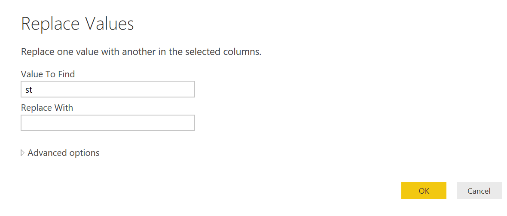

# Azure IOT AVRO

## Setup Steps

### Project Installation

Start by installing all dependencies with:

```sh
node install.js
```

This process will take several minutes, now would be a good time to grab a coffee.

### Cosmos DB

To set up an instance of Cosmos DB you will first need an [Azure](https://azure.microsoft.com/en-us/account/) account. 

From the [portal](portal.azure.com) create a new Azure Cosmos DB. 


Fill out the New account blade with your information. For the API section, select SQL (DocumentDB) from the drop down and be sure to select the location closest to you.


Once the deployment has finished, open up Cosmos DB and add a new database and collection to store the schemas. You will need a second database with it's own collection to store the messages being written out. When you fill out your `.env` file for the schema and message microservices, ensure that you put the proper database and collection names for each.


To learn more about setting up your Cosmos DB account, visit the online [documentation](https://docs.microsoft.com/en-us/azure/cosmos-db/create-documentdb-nodejs).


## Debugging the common module

If you need to debug and edit the common module, you need to go through a couple of steps first. Run the following commands:

```sh
cd common
npm link
cd ../client
npm link common
cd ../server/decompress
npm link common
cd ../message
npm link common
cd ../schema
npm link common
```

## Microservices Overview

### Schema Service

The schema service is a Node.js Express API with two endpoints, one for querying a specific schema and one for querying all schemas. 

The first endpoint is `/api/schema` and it takes a query string parameter called `schemaId` represented in the the form `{SCHEMA NAME}:{SCHEMA VERSION}`. With this id, it calls a Cosmos DB stored procedure that searchs for and returns the schema with the specified id. If the id is in an invalid format the API returns a 400 Bad Request, and if the record wasn't found it returns a 500 Internal Server Error. 

 The second endpoint is `/api/allSchemas` and takes no query string parameters. It simply calls a Cosmos DB stored procedure to return all of the schemas stored.

 Each time this service runs, it first calls `docDbClient.readStoredProcedure` to validate that the stored procedures exist on Cosmos DB already. If they aren't found, it will create them. Each time you modify the stored procedure code you will need to update them manually in Cosmos DB by either deleting the old versions and running this service again, editing the code inline in the Azure Portal, or adding an update function that will do this programatically. More information about creating stored procedures for Cosmos DB can be found [here](https://docs.microsoft.com/en-us/azure/documentdb/documentdb-programming). 

### Decompression Service


### Message Service

The message service listens to the store message request queue that the decompression service is writing to. It has a `processNextMessage()` function that runs in an infinite recurisive loop to listen for incoming requests and then process them. If the service finds a request to process, it calls a helper function in the cosmos file of the common helper module. This function ensures that the incoming message is valid JSON and then writes a new document to the Cosmos DB message database with fields for the schemaId for that message, the message payload, and the current timestamp to be used for reporting.

## Deploying to Service Fabric
The 'sfdeployment'directory contains everything you should need to deploy the services as a service fabric guest app, into either a local or remote service fabric cluster:

### Pre requisites
You'll need to follow the azure guide to [Setting up a service fabric dev. environment](https://docs.microsoft.com/en-us/azure/service-fabric/service-fabric-get-started)

### Deploying to local cluster.
1) Load the IoTAzure solution, and build the guest executable package.
2) Right click the 'IoTAzureSF' service (just beneath the solution) and select 'Publish'
3) Select the publish profile for your local cluster configuration (1 node or 5 node).
4) Ensure the 'upgrade' box is not checked.
5) Click Publish, the package and deploy process can sometimes take a while, so be patient, any errors in packaging appear in the build output, rollout/startup issues appear in the cluster logs. 

NB: During deployment, cluster will report unhealthy whilst the number of micro service instances is less than the target number. Whilst the app is in 'Building' status, this is expected. If app goes to 'ready' and is still unhealthy, check logs for a likely exception.

## Visualizing Data with Power BI Desktop

To create a Power BI report to visualize this data, first download [Power BI Desktop](https://powerbi.microsoft.com/en-us/desktop/). 

Open Power BI and select `Get Data` from the toolbar on the top. Select `Azure Document DB (beta)` from the drop down list and press connect. You will need to enter the URL of your Cosmos DB and your account key, both of which can be found in your Cosmos DB instance in the Azure portal. 


Select the message database and colleciton you created and press the `Edit` button to launch the query editor.


In the query editor you will see a Document column with all of the records listed. Click the arrows on the right side of the column title to see a list of fields to include in the query. Check `schemaId`, `timestamp`, `message`, and `id` then click `Okay`. 


You should see the number of columns expand to include the new fields we just added. Because `message` is a JSON object and not just a single field, we still see it represented as "Record". To expand this, select the arrows at the top right of the column title and select the proper columns then press `Okay`.


Next, we need to format the date so that Power BI can recognize it in our report. Right click on the title row of the `timestamp` column and select `Replace Values`. In the box that pops up enter `st` in the value to find field and don't replace it with anything. Press `Okay` and repeat the process entering `rd` and `th` to replace all of the date endings with empty strings as well. 



After we have replaced the values, we can split the column on the comma so we have one column for the date, and another for the time.


From there, our data is ready to be visualized however you want for any given specific application. Below is a screenshot of some sample visualizations for this data set. You can find custom visuals [here](https://app.powerbi.com/visuals/) or use the built in ones following [this guide.](https://powerbi.microsoft.com/en-us/documentation/powerbi-service-visualizations-for-reports/)


